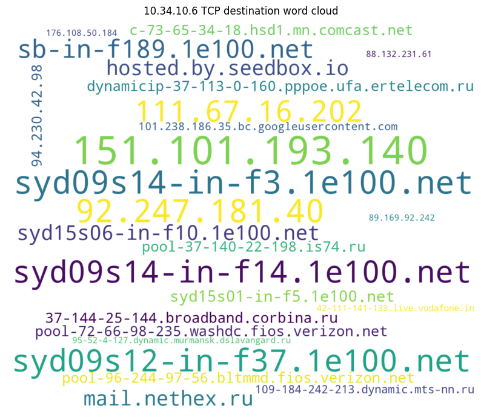

# SecurIOT
Security test bed for IOT device information leak and vulnerability scanning

Idea is to enable script kiddies to describe and test IOT devices for vulnerabilities and 
to figure out what data they are leaking if any.

pcap contains code to parse a pcap file and make wordclouds of destinations for each source IP
together with host:port specific destination port wordclouds as part of the fingerprinting process
for a new IOT device. 

For example, to make a decent sized file to analyse,

**sudo tcpdump host [IOT IP] -i eth0 -c 10000 -w IOTNAME.pcap**

will capture all traffic to and from any device IP address and produce wordclouds showing 
how much goes where.

Destinations:

Ports:

pmap contains a simple but reasonably fast threaded port scanner.
It works something like this:

	Enter a remote host to scan: 127.0.0.1
	------------------------------------------------------------
	Please wait, scanning remote host 127.0.0.1
	------------------------------------------------------------
	port 22 open
	port 631 open
	port 5001 open
	port 32772 open
	port 43208 open
	port 51413 open
	Scanning Completed in:  0:00:07.013983 secs

Because we can.

